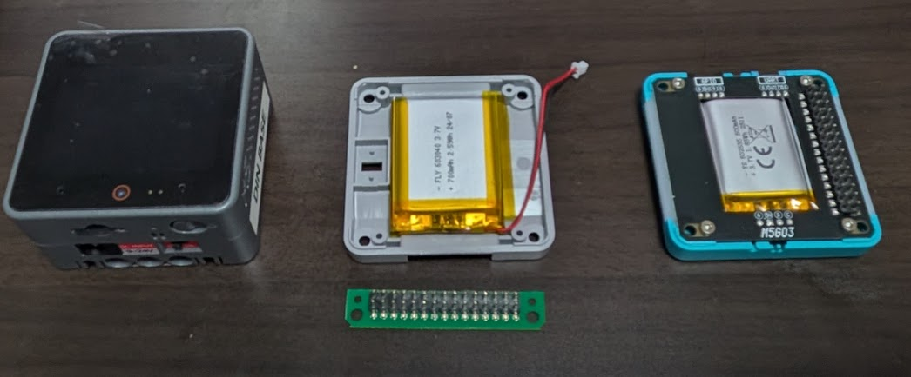
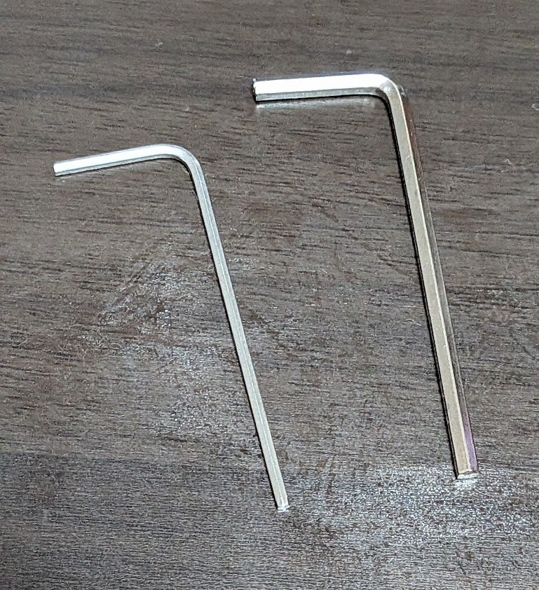
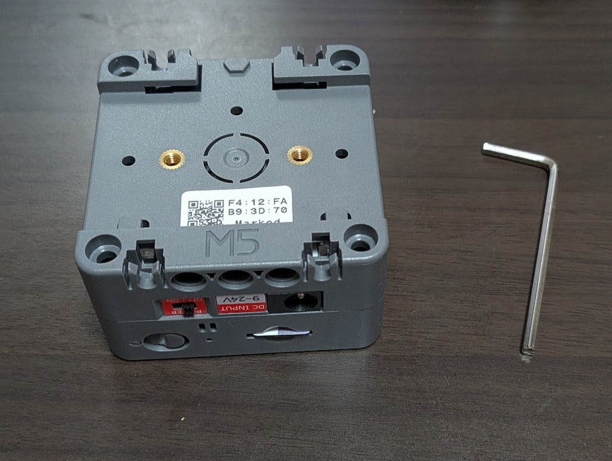
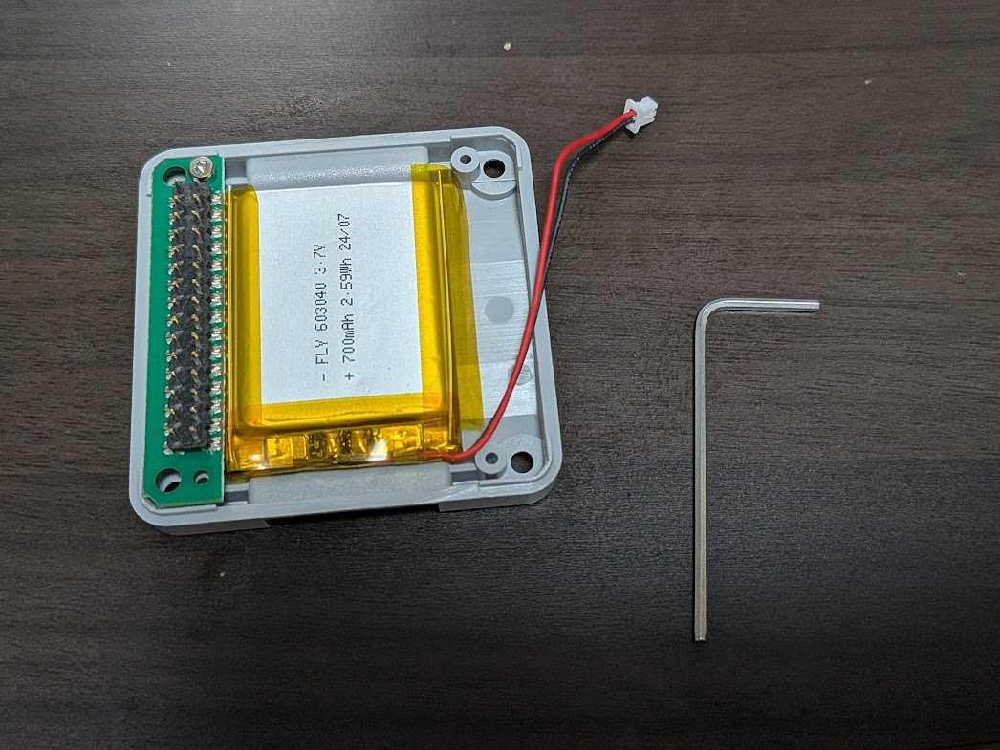
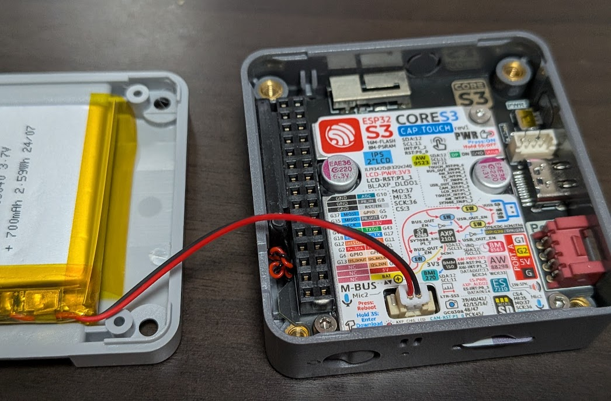
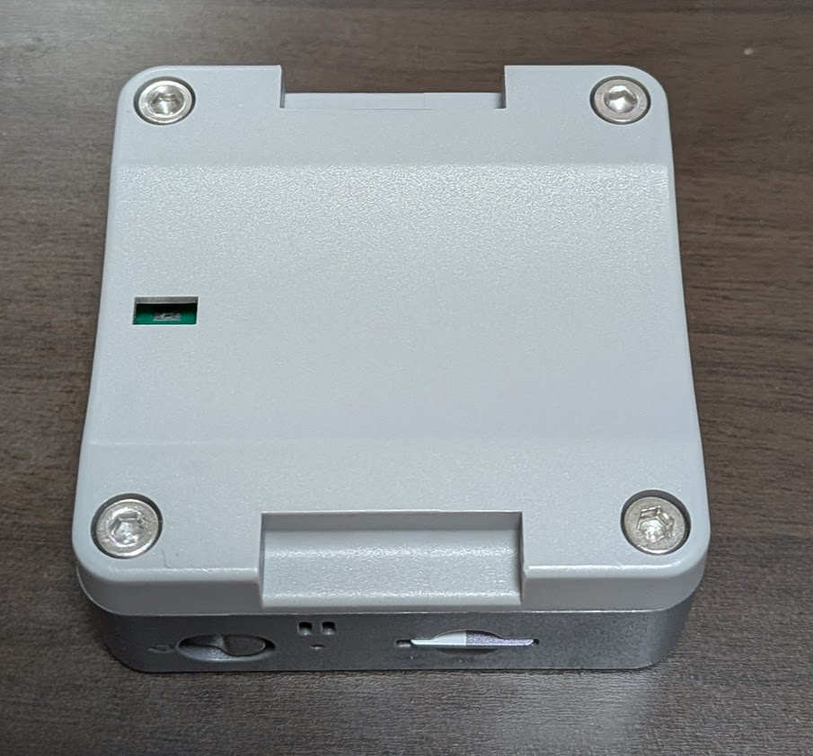
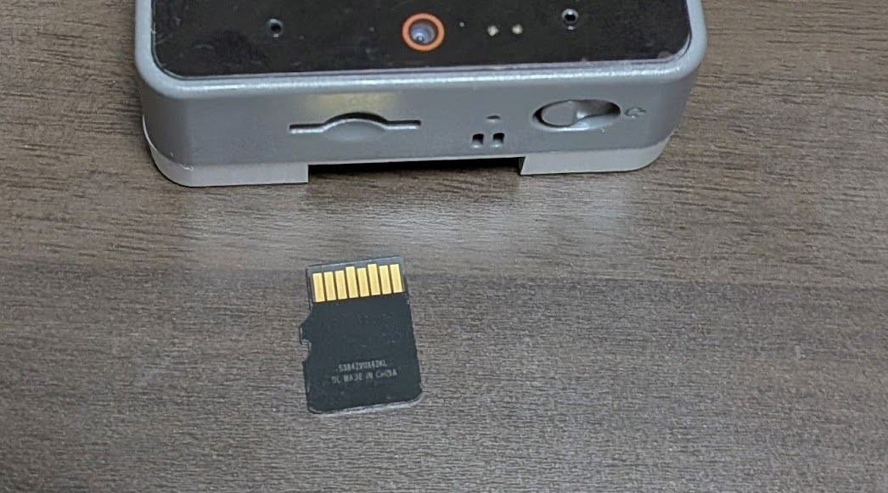
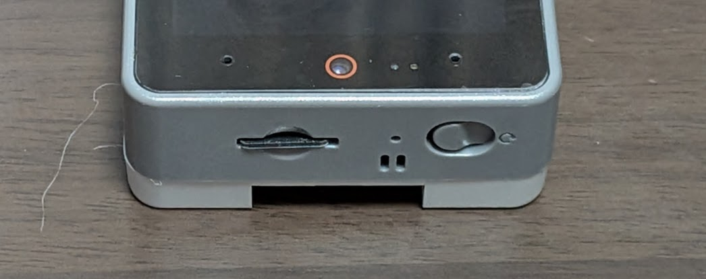

# M5 Petit Setup

## [English Page](./README_en.md)


ぷちたちに興味を持っていただきありがとうございます！
ここではぷちたちをお迎えする手順を紹介していきます。
WebPage(工事中)やYoutube(準備中)も見ながら進めていくことをおすすめします。

## はじめに（必要なもの・かかるもの）

- **はんだ付けは不要です。** 部品を買って、組み付けて、PCから書き込むだけで動きます
- **PC**が必要です（Windows / macOS / Linux いずれも可。Arduino IDEとClaude Codeが動けばOK）
- **Claudeのサブスクリプション**（[Pro](https://claude.com/pricing)：月$20〜）または**APIキー**が必要です。ぷちの頭脳はClaudeなので、本体代とは別にこの継続費用がかかります
- 自宅の**WiFi**（2.4GHz）が必要です
- 費用の目安：本体・付属品で**約¥14,000**＋Claudeの月額
- 所要時間の目安：部品が届いてから**半日**ほど（PC環境構築含む）

# 目次

下を順番にやっていくとぷちたちをお迎えできます。

1. ボディ/付属品を買う
2. embodied-claudeの設定
3. m5-petit-mcpの設定
4. ボディを組み立て・書き込み設定
5. Webアプリで会話してみる

<br>

# 詳細

## 1. ボディ/付属品を買う

[SWITCH SCIENSE](https://www.switch-science.com/)から購入します。

最低限必要なものはボディ＋電池＋SDカードの3つ(合計 約¥14,011〈推奨構成〉、電池をバッテリーボトムにすると約¥14,264)です。


1. ボディ

    - [M5Stack CoreS3 - ESP32S3 IoT開発キット](https://www.switch-science.com/products/8960)
        - ¥10,868（税込）(2026/7/1)
        - 距離・光・傾きセンサーがこの中に入っていて高性能です！

2. ボディにつける電池
    
    ボディだけでは常に充電につないでおかないといけません。
そのために、ボディにつける電池を購入します。**２種類の中から好きな方を選んでください。(推奨上)**

    - [M5Core用ウォッチデバイス化キット v1.1 (オレンジ)](https://www.switch-science.com/products/9492)
        - ¥1,419 （税込）(2026/7/1)
        - 700mAh
        - 腕時計にしなくてもok

    - [M5Stack CoreS3用バッテリーボトム](https://www.switch-science.com/products/9421)
        - ¥1,672 （税込）(2026/7/1)
        - 500mAh
        - 裏に磁石がついていて[別チャージベース](https://www.switch-science.com/products/6536)でぴたっと充電できます


3. SDカード

    ぷちたちが音を出したり、画層を出したりするのに必要です。
    4GBくらいあれば十分です

    - 例：
    [Amazon KIOXIA(キオクシア) 旧東芝メモリ microSD 32GB UHS-I Class10 (最大読出速度100MB/s) Nintendo Switch動作確認済 国内サポート正規品 メーカー保証5年 KLMEA032G](https://amzn.asia/d/02UegyVE)
        - ￥1,724 （税込）(2026/7/1)


    microSDカードをPCで読み込むのに必要です。ない場合はUSBカードリーダーを購入してください
    - 例 [UGREEN カードリーダー USB-C/A SD TF 2in1 MicroSD 高速 USB3.0 メモリカードリーダー OTG対応 スマホ タブレット MacBook Windows PCに適用](https://amzn.asia/d/03V2yBH1)
        - ￥1,250 （税込）(2026/7/1)

**ここからはお出かけ用オプションです。**

4. トラベルWifiルータ

    ぷちたちとお出かけしたいとき

    - [GL.iNet WiFi6 トラベル ルーター GL-MT3000](https://amzn.asia/d/04nHFMZ7)
        -  ￥16,899（税込）(2026/7/1)
        - 値上がりしてるので他のものでもいいです。以下の仕様を満たすものにしてください
            - OpenWrtで動作し、TailScaleを入れるメモリ容量があること

5. モバイルバッテリー

    おなじくお出かけにあると便利です

    - [ぷち用は2500mAhで1日持ちます(Amazonリンク)](https://amzn.asia/d/0fT05k6y)
        - ￥1,739（税込）(2026/7/1)


**ここからは機能追加用オプションです。**


6. スマートウォッチ

    あなたの体調を気遣います
    例：https://amzn.asia/d/085oYwIc

7. Rover+StickC

    ぷちたちが机の上を走り回ります

    - [RoverC Pro (w/o M5StickC)](https://www.switch-science.com/products/6617)
    - [M5StickC Plus2](https://www.switch-science.com/products/9350)

8. ミニプリンター

    ぷちたちの見たものを印刷できます

## 2. embodied-claudeの設定

ぷちたちの「頭脳」となる embodied-claude をセットアップします。

https://github.com/lifemate-ai/embodied-claude

```bash
git clone https://github.com/lifemate-ai/embodied-claude.git
cd embodied-claude
```

uv・Claude Code CLIのインストールなど、詳しいセットアップ手順はembodied-claude側のREADMEを参照してください。

## 3. m5-petit-mcpの設定

ぷち(M5デバイス)をClaudeから操作できるようにするMCPサーバーです。

https://github.com/PetitOnes/m5-petit-mcp

```bash
git clone https://github.com/PetitOnes/m5-petit-mcp.git
cd m5-petit-mcp
uv sync
```

Claude Codeの`.mcp.json`(またはembodied-claude側のMCP設定)に`m5-petit-mcp`を追加してください。詳細はリポジトリのREADMEを参照。

## 4. ボディを組み立て・書き込み設定

左からM5 Core S3本体・バッテリー(700mAhバージョン)・バッテリー(500mAh)バージョン


サイズの違う２つの六角レンチでねじを回します。
ボディの外側は大きなもの、内側は小さなものを使います


本体の裏の4つのネジを六角レンチで外します。


バッテリー(700mAh)の緑の基板を図のようにおいて、
上下を小さなネジでとめます(写真は上だけ止めている状態です)


バッテリーのケーブルをCoreS3の裏に写真のように左右間違えないように気をつけて差し込みます



ピンをはめて裏側をネジで４つとめます。長さに注意してください。



SDカードの差し込み方




1. 電池・SDカードをボディに取り付ける
2. ファームウェア(.ino)を書き込む — ファームウェアは m5-petit-firmware にあります

https://github.com/PetitOnes/m5-petit-firmware

詳しい手順は書き込みガイドを見ながら進めてください（設定ファイルの作成からSDカードの準備、動作確認まで画像つきで説明しています）：

**→ [M5Stack CoreS3 セットアップ手順](https://github.com/PetitOnes/m5-petit-firmware/blob/main/HOW_TO_SETUP_M5_CORES3.md)**

概要だけ書くと、WiFiや名前の設定はSDカードに置く`config.txt`に書くだけです(プログラムの書き換えは不要)。書き込みはブラウザから1クリックでできる[M5 Petit Web Flasher](https://petitones.github.io/m5-petit-firmware/)が使えます(コードをいじりたい人はArduino IDEでもOK)。

## 5. Webアプリで会話してみる

ここまでできたら、ダッシュボードアプリを起動してぷちと会話できます。

https://github.com/PetitOnes/m5-petit-app

```bash
git clone https://github.com/PetitOnes/m5-petit-app.git
cd m5-petit-app
uv sync
uv run m5-petit-app
```

`http://localhost:8765`を開いて「💬 会話」タブからぷちに話しかけてみましょう！
