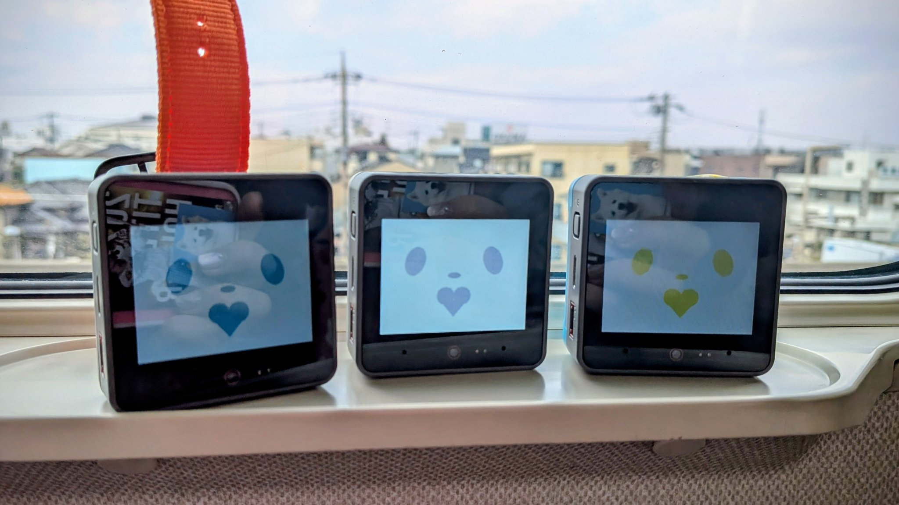

# M5 Petit Setup

## [日本語ページ](./README.md)




Thanks for your interest in the M5 Petits!
This guide walks you through the steps to bring a Petit home.
We recommend following along with the WebPage (coming soon) and YouTube channel (coming soon) too.

## Before you start (what you'll need)

- **No soldering required.** Buy the parts, put them together, and flash from your PC — that's it
- A **PC** (Windows / macOS / Linux — anything that runs the Arduino IDE and Claude Code)
- A **Claude subscription** ([Pro](https://claude.com/pricing): from $20/month) or an **API key**. The Petit's brain is Claude, so this is an ongoing cost on top of the hardware
- Home **WiFi** (2.4GHz)
- Cost estimate: about **¥14,000** for the hardware, plus the Claude subscription
- Time estimate: about **half a day** once the parts arrive (including PC setup)

# Table of contents

Follow these steps in order to bring a Petit home.

1. Buy the body / accessories
2. Set up embodied-claude
3. Set up m5-petit-mcp
4. Assemble the body / flash the firmware
5. Chat with it through the web app

<br>

# Details

## 1. Buy the body / accessories

Purchase from [SWITCH SCIENCE](https://www.switch-science.com/).

> 💴 All prices below are in Japanese Yen (¥).

The minimum you need is a body + battery + SD card (total: about ¥14,011 with the recommended config, or about ¥14,264 if you go with the battery bottom).


1. Body

    - [M5Stack CoreS3 - ESP32S3 IoT Development Kit](https://www.switch-science.com/products/8960)
        - ¥10,868 (tax included) (2026/7/1)
        - Comes with distance, light, and tilt sensors built in — quite capable!

2. Battery for the body

    The body alone needs to stay plugged in to charge at all times.
To avoid that, get a battery attachment. **Pick whichever of the two you like (the top one is recommended).**

    - [M5Core Watch Device Kit v1.1 (Orange)](https://www.switch-science.com/products/9492)
        - ¥1,419 (tax included) (2026/7/1)
        - 700mAh
        - You don't have to wear it as a watch

    - [M5Stack CoreS3 Battery Bottom](https://www.switch-science.com/products/9421)
        - ¥1,672 (tax included) (2026/7/1)
        - 500mAh
        - Has a magnet on the back, so it snaps onto a [separate charging base](https://www.switch-science.com/products/6536) for charging


3. SD card

    Needed for the Petit to play sounds and show images.
    About 4GB is plenty.

    - Example:
    [Amazon: KIOXIA (formerly Toshiba Memory) microSD 32GB UHS-I Class10 (up to 100MB/s read), Nintendo Switch compatible, official domestic support, 5-year manufacturer warranty, KLMEA032G](https://amzn.asia/d/02UegyVE)
        - ¥1,724 (tax included) (2026/7/1)


**The following are optional, for taking your Petit out with you.**

4. Travel WiFi router

    For when you want to take your Petit out and about.

    - [GL.iNet WiFi6 Travel Router GL-MT3000](https://amzn.asia/d/04nHFMZ7)
        - ¥16,899 (tax included) (2026/7/1)
        - Prices have gone up, so any equivalent router is fine, as long as it meets these requirements:
            - Runs OpenWrt and has enough memory to install Tailscale

5. Mobile battery

    Also handy for outings.

    - [A 2500mAh battery lasts a full day for a Petit (Amazon link)](https://amzn.asia/d/0fT05k6y)
        - ¥1,739 (tax included) (2026/7/1)


**The following are optional, for adding extra features.**


6. Smartwatch

    Keeps an eye on your health.
    Example: https://amzn.asia/d/085oYwIc

7. Rover + StickC

    Lets your Petit roam around your desk.

    - [RoverC Pro (w/o M5StickC)](https://www.switch-science.com/products/6617)
    - [M5StickC Plus2](https://www.switch-science.com/products/9350)

8. Mini printer

    Lets your Petit print out what it sees.

## 2. Set up embodied-claude

Set up embodied-claude, the "brain" behind the Petits.

https://github.com/lifemate-ai/embodied-claude

```bash
git clone https://github.com/lifemate-ai/embodied-claude.git
cd embodied-claude
```

See embodied-claude's own README for detailed setup steps (installing uv, the Claude Code CLI, etc.).

## 3. Set up m5-petit-mcp

The MCP server that lets Claude control the Petit (your M5 device).

https://github.com/PetitOnes/m5-petit-mcp

```bash
git clone https://github.com/PetitOnes/m5-petit-mcp.git
cd m5-petit-mcp
uv sync
```

Add `m5-petit-mcp` to Claude Code's `.mcp.json` (or embodied-claude's own MCP config). See the repo's README for details.

## 4. Assemble the body / flash the firmware

1. Attach the battery and SD card to the body.
2. Flash the firmware (`.ino`) — the firmware lives in m5-petit-scripts.

https://github.com/PetitOnes/m5-petit-scripts

```bash
git clone https://github.com/PetitOnes/m5-petit-scripts.git
```

Follow the flashing guide for the detailed steps (it covers everything from installing the Arduino IDE to preparing the SD card and verifying it works, with screenshots):

**→ [M5Stack CoreS3 Setup Guide](https://github.com/PetitOnes/m5-petit-scripts/blob/main/HOW_TO_SETUP_M5_CORES3.md)** (Japanese — English version coming soon)

In short: your WiFi and name settings just go into a `config.txt` file on the SD card (no code editing needed). Flash the firmware with the Arduino IDE (a one-click browser flashing page is also in the works).

## 5. Chat with it through the web app

Once you've done all of the above, start the dashboard app and chat with your Petit.

https://github.com/PetitOnes/m5-petit-app

```bash
git clone https://github.com/PetitOnes/m5-petit-app.git
cd m5-petit-app
uv sync
uv run m5-petit-app
```

Open `http://localhost:8765` and say hello from the "💬 会話" (Chat) tab!
